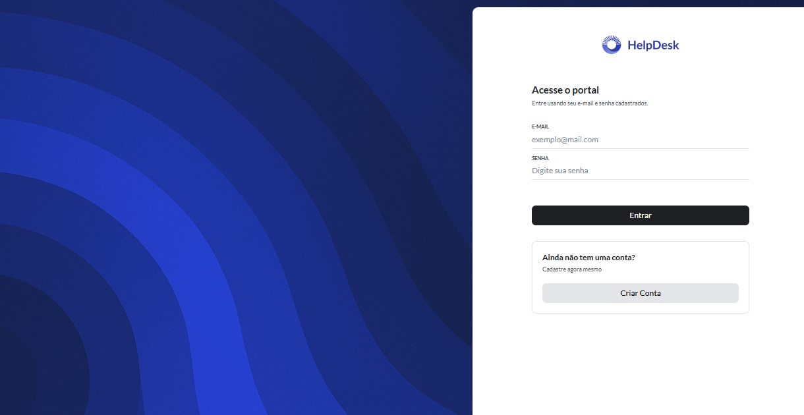
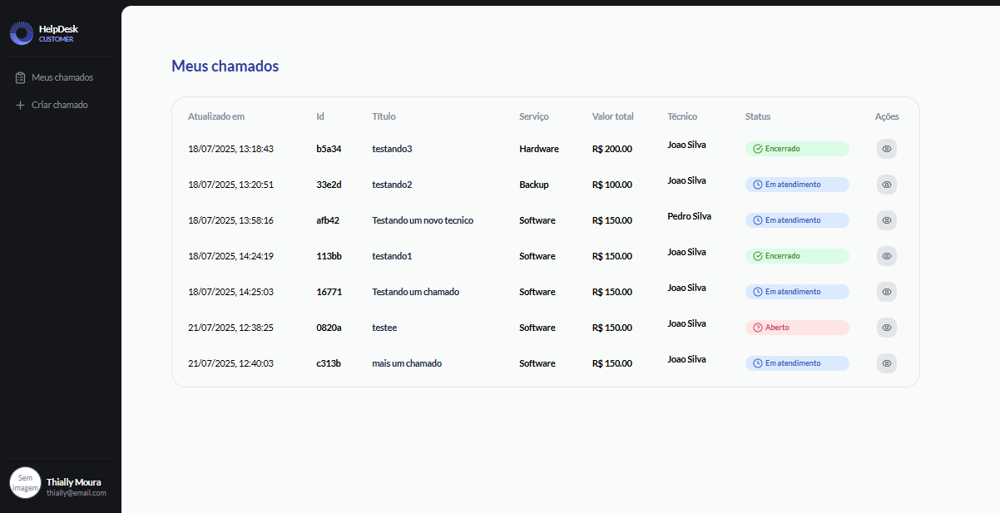
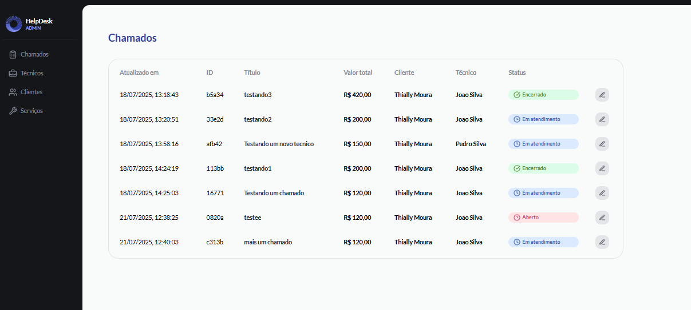
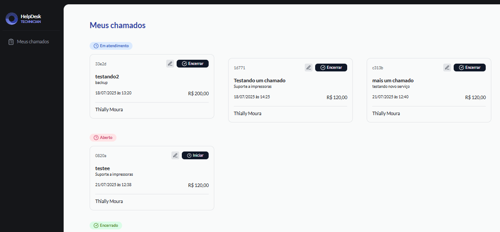

<h1> 🚀 Sistema de Gerenciamento de Chamados </h1>

<p align="center">
  
  
   
    
</p>

## 💻 Projeto

O helpDesk é um Sistema de Gerenciamento de Chamados, desenvolvido por mim como desafio prático para finalização do curso Full-Stack.
A aplicação simula um painel de gerenciamento de chamados completo, permitindo interações entre Administrador, Técnico e Cliente, com controle de usuários, chamados e status de atendimento.

## 🚀 Tecnologias

Esse projeto foi desenvolvido utilizando as seguintes tecnologias:

- React.js + vite
- TypeScript

📋 Gerenciamento de Chamados

- CRUD completo de chamados:

  - Criar
  - Visualizar
  - Atualizar
  - Deletar

- Status dos chamados:

  - Aberto
  - Em andamento
  - Concluído

- Atribuição de chamados a técnicos e controle de prioridades.

## ✅ Como rodar o projeto localmente

### ⚙️ Instalação

1. Clone o repositório 🖥️:

```sh
git clone https://github.com/thiallymoura/helpdesk-web.git
cd helpdesk-web
```

2. Instale as dependências 📦:

```sh
npm install
```

### 🚧 Desenvolvimento

Iniciar a aplicação em modo desenvolvimento

```sh
npm run dev
```
